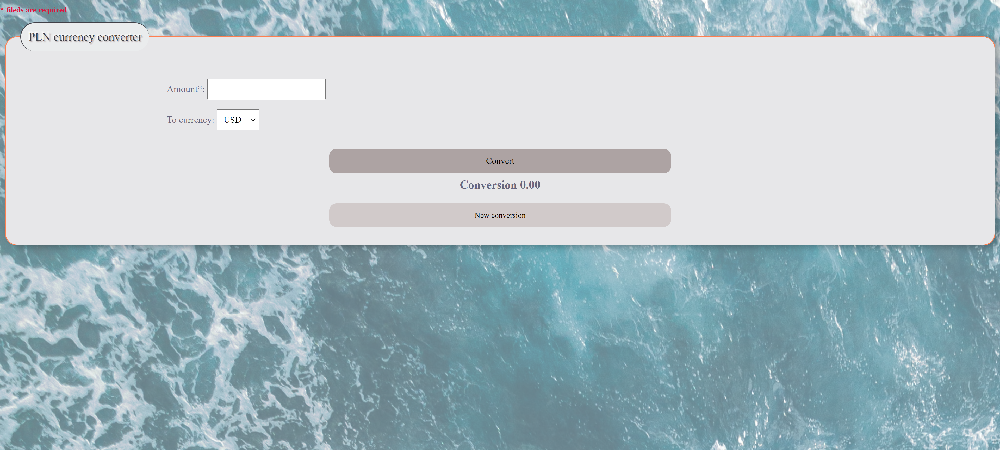
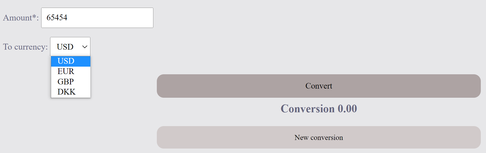

Currency Exchange Website

https://micfig76.github.io/Currency/

Welcome to my polish zloty currency exchange website! This website allows you to convert amount in polish zloty
into one of four currencies using the preloaded exchange rates.

Features.

    Choice of currencies: Select one of four currencies you want to compare from a drop-down menu of available 
    currencies.
    
    Amount field: Enter the amount you want to convert.
    
    Calculate button: Click this button to display the conversion result.
    
    New Conversion button: Click this button to clear the form and start a new conversion.

Usage

    Open the website in your web browser.
    Select the currencies you want to compare from the drop-down menu.
    Enter the amount you want to convert in the amount field.
    Click the Calculate button to see the conversion result.
    To start a new conversion, click the New Conversion button.

Technologies Used

This website was built using HTML, CSS, and JavaScript. 
This website uses the Exchange from the date stated on the website. 

This website was created by [Michal Figiel]. If you have any questions or feedback, please contact me at [figielmichal76@gmail.com].
